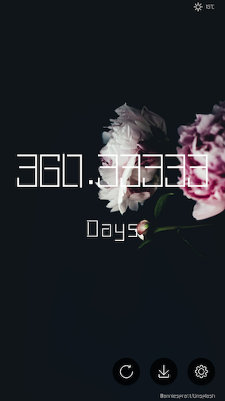

# Time
纪念日应用

## 截图

## 下载链接

因为不打算发布到应用市场，所以挂在[Fir](https://fir.im/timeLTNS)上，一方面方便下载和后续应用内更新，另一方面也是用了[BugHD](http://bughd.com/)的崩溃收集。

附上[下载链接](https://fir.im/timeLTNS)，欢迎下载试用:D

## 功能

- 主页显示从纪念日开始计时，距今时长。可以以多种模式（月、周、日、时）显示
- 用户可随时更新首页背景
- 可以下载高清背景图到本地
- 首页显示当日天气状况及气温
- 应用内自动更新

## 感谢

- [Unsplash](https://unsplash.com/)
- [OkHttpUtils](https://github.com/hongyangAndroid/okhttputils)

## 扯扯淡
- 女朋友之前用的纪念日应用，不经意间看到了，界面讲道理真的丑，于是作为一个有情怀（闲着无聊）的小猿就写了这样一个应用，马上一年，啊哈哈
